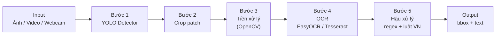

## Buổi 1 – Khởi động & Lập kế hoạch

### 1. Thông tin chung

- **Đề tài**: Nhận diện biển số xe Việt Nam (phát hiện + OCR).
- **Mục tiêu tổng thể**:
  - Xây dựng hệ thống nhận diện biển số gồm:
    - Phát hiện vùng biển số (object detection).
    - Nhận dạng ký tự trên biển số (OCR).
  - Đạt **độ chính xác OCR ≥ 85%** trên **≥ 200 ảnh biển số thực tế** (không dùng để train).
  - Có **demo** chạy được trên ảnh/video/webcam, kèm **báo cáo + slide** hoàn chỉnh.
- **Phạm vi kỹ thuật (gợi ý)**:
  - Detection: một mô hình YOLO (ví dụ YOLOv8) đã train/finetune trên dữ liệu biển số.
  - OCR: không bắt buộc train lại từ đầu; có thể dùng EasyOCR/Tesseract + tiền xử lý + hậu xử lý.
  - Toàn pipeline chạy offline trên máy cá nhân (GPU khuyến nghị cho train YOLO, CPU vẫn chạy được inference chậm hơn).

### 2. Chuẩn bị môi trường làm việc

**Nhiệm vụ**

1. Tạo cấu trúc thư mục ban đầu trong `ComputerVisionPj`:
   - `data/` – cấu hình dataset YOLO (`data/data.yaml`), sau này có thể thêm `raw/`, `labels/`, `splits/` theo buổi 2.
   - `notebooks/` – EDA, thử nghiệm.
   - `src/` – mã nguồn chính (`detector/`, `ocr/`, `preprocess/`, `app/` theo `AGENTS.md`).
   - `docs/` – tài liệu, kế hoạch, báo cáo.
   - `datakangle/` (hoặc bộ dữ liệu tương đương) – **chỉ lưu local**, thường **không đẩy Git** (đã có trong `.gitignore`); trên repo chỉ giữ `data/data.yaml` + script chuẩn bị dữ liệu.

2. Cài đặt Python (nếu chưa có):
   - Phiên bản: **Python 3.10+**.
   - Khi cài, tick **“Add Python to PATH”**.

3. Tạo môi trường ảo:
   - Trong thư mục project:
     - `python -m venv .venv`
     - Kích hoạt (PowerShell): `.\.venv\Scripts\Activate.ps1`
   - Nếu PowerShell báo lỗi execution policy, có thể chạy tạm thời:  
     `Set-ExecutionPolicy -ExecutionPolicy RemoteSigned -Scope CurrentUser`  
     (chỉ trên máy cá nhân; hỏi ý kiến nếu dùng máy lab/CTY).

4. Cài các thư viện **tối thiểu buổi 1** (đọc ảnh, vẽ, thử OpenCV):

   ```text
   pip install opencv-python numpy matplotlib
   ```

5. **Tuỳ chọn** (cài sớm hoặc để buổi 2–3): phục vụ train/inference YOLO và OCR sau này:

   ```text
   pip install ultralytics easyocr
   ```

   Tesseract nếu chọn nhánh Tesseract: cần cài **binary Tesseract** trên Windows + gói Python `pytesseract` (làm khi bắt đầu tích hợp).

**Kết quả mong đợi**

- Có cấu trúc thư mục project rõ ràng.
- Môi trường ảo `.venv` hoạt động, import được OpenCV, NumPy, Matplotlib trong Python.
- Biết chỗ đặt file cấu hình YOLO: `data/data.yaml` trỏ tới thư mục dataset local (ví dụ `datakangle`).

### 3. Mô tả bài toán & mục tiêu chi tiết

**Nhiệm vụ**

1. Viết mô tả bài toán (1–2 trang, lưu vào `docs/mo_ta_bai_toan.md` hoặc `.docx`):
   - Bài toán: “Nhận diện biển số xe Việt Nam từ ảnh/video (phát hiện + OCR)”.
   - Ứng dụng: bãi giữ xe, trạm thu phí, camera giao thông, hệ thống quản lý ra/vào.
   - Lợi ích: tự động hóa, giảm công sức con người, tăng độ chính xác (khi hệ thống ổn định).

2. Xác định rõ **input / output**:
   - **Input**:
     - Ảnh tĩnh chứa xe (jpg/png).
     - Hoặc video (mp4) / luồng webcam.
   - **Output**:
     - Ảnh/video có vẽ khung (bounding box) quanh biển số (và có thể ghi confidence).
     - Chuỗi text tương ứng với từng biển số (ví dụ: `51F-123.45`).
   - **Lưu ý**: một ảnh có thể có **nhiều** biển số → pipeline phải lặp các bước 2–5 cho **từng** box hợp lệ sau bước 1.

3. Ghi rõ các **mục tiêu định lượng**:
   - **Detection**:
     - mAP (hoặc metric tương đương) trên tập test khoảng ≥ 0.8 — **mốc tham khảo**, có thể điều chỉnh theo độ khó dữ liệu và thời gian.
   - **OCR**:
     - Character accuracy ≥ 85% trên ≥ 200 ảnh **patch biển số** hoặc ảnh đã crop (tập không dùng để train detector/OCR).
   - **Demo**:
     - Chạy được trên ít nhất 1 video hoặc webcam, hiển thị bbox + text (real-time hoặc gần real-time tùy phần cứng).

**Kết quả mong đợi**

- Có file mô tả bài toán, nêu rõ bối cảnh, input/output, goal định lượng để các buổi sau bám theo.
- Trong báo cáo nên **định nghĩa cách đo** OCR (character-level / plate-level) để tránh hiểu nhầm khi báo cáo %.

### 4. Khảo sát & chốt stack công nghệ

#### 4.1. Pipeline giải pháp — hiểu chi tiết từng bước

Pipeline tách **hai giai đoạn**: (A) **tìm vùng biển** trong ảnh lớn, (B) **đọc chữ** trong vùng nhỏ đã cắt. Dữ liệu đi qua các bước như sau.

**Bước 1 — YOLO phát hiện vùng biển số**

| Khía cạnh | Nội dung |
|-----------|----------|
| **Mục đích** | Tìm **vị trí** biển số trong ảnh toàn cảnh; không đọc nội dung chữ ở bước này. |
| **Đầu vào** | Ảnh RGB/BGR (ma trận pixel), thường resize theo kích thước train của YOLO (ví dụ 640×640) bên trong model. |
| **Đầu ra** | Một hoặc nhiều **bounding box** `(x1, y1, x2, y2)` (hoặc tương đương) + **class** (ví dụ một class `license_plate`, hoặc nhiều class kiểu biển đen/vàng nếu dataset có phân loại) + **confidence**. |
| **Vì sao cần** | OCR trên cả ảnh xe sẽ nhận thêm nhiễu (đường, người, chữ quảng cáo). Cô lập patch biển giúp tăng tỉ lệ đọc đúng và giảm chi phí tính toán cho OCR. |
| **Gợi ý triển khai** | Huấn luyện / inference **YOLOv8** (Ultralytics), file cấu hình dataset: `data/data.yaml`. Mã nguồn gợi ý: `src/detector/`. |
| **Lưu ý** | Dataset có thể là nhãn **segmentation** (đa giác) hoặc **bbox**; khi chỉ cần detection có thể chuyển polygon → bbox (đã có script `src/detector/convert_polygon_to_yolo_bbox.py` trong project). |

**Bước 2 — Cắt (crop) vùng biển số**

| Khía cạnh | Nội dung |
|-----------|----------|
| **Mục đích** | Tạo **ảnh con (patch)** chứa gần như toàn bộ biển số để đưa vào OCR. |
| **Đầu vào** | Ảnh gốc + tọa độ box từ bước 1. |
| **Đầu ra** | Ma trận ảnh nhỏ (patch), kích thước pixel phụ thuộc box (có thể thêm **padding** vài % kích thước box để không cắt sát viền chữ). |
| **Vì sao cần** | OCR hoạt động tốt hơn khi **chữ đủ lớn, tương phản tốt** trong vùng đầu vào; crop giúp “phóng to” vùng quan tâm. |
| **Gợi ý triển khai** | OpenCV: cắt theo ROI, ép kiểu int, clip tọa độ trong biên ảnh. Module gợi ý: `src/preprocess/` hoặc `src/detector/` (hàm tách riêng `crop_plate(image, box)`). |

**Bước 3 — Tiền xử lý ảnh biển số**

| Khía cạnh | Nội dung |
|-----------|----------|
| **Mục đích** | Làm patch **dễ đọc** hơn cho OCR: tăng tương phản, giảm nhiễu, chuẩn hóa kích thước. |
| **Đầu vào** | Patch màu hoặc xám từ bước 2. |
| **Đầu ra** | Patch đã xử lý (có thể vẫn là ảnh màu, hoặc ảnh xám, hoặc nhị phân tùy thử nghiệm). |
| **Thao tác thường gặp** | Chuyển xám; resize theo chiều rộng/cao tối thiểu; Gaussian blur nhẹ; cân bằng histogram (CLAHE); threshold (Otsu/adaptive); morphological open/close để tách nét. |
| **Vì sao cần** | Ảnh ngoài trời: lệch sáng, phản chiếu, mờ. **Tesseract** thường nhạy với nhị phân hóa rõ; **EasyOCR** đôi khi ổn với ảnh tự nhiên — nên **thử A/B** có/không tiền xử lý và ghi lại kết quả trong báo cáo. |
| **Gợi ý triển khai** | Tách hàm rời: `preprocess_for_ocr(patch) -> patch_processed` trong `src/preprocess/`. |

**Bước 4 — EasyOCR / Tesseract đọc ký tự**

| Khía cạnh | Nội dung |
|-----------|----------|
| **Mục đích** | Chuyển ảnh patch thành **chuỗi ký tự** (text). |
| **Đầu vào** | Patch (đã hoặc chưa tiền xử lý). |
| **Đầu ra** | Chuỗi thô, ví dụ `51F 12345`, `5IF-123.45`; có thể kèm bbox từng ký tự hoặc điểm tin cậy (tuỳ API). |
| **Vì sao hai lựa chọn** | **EasyOCR**: cài đặt nhanh, thường tốt với ảnh “tự nhiên”, hỗ trợ tiếng có ký tự Latin. **Tesseract**: mạnh khi ảnh đã tiền xử lý tốt; cần chọn **PSM** (page segmentation mode) phù hợp (một dòng chữ vs cả patch). |
| **Gợi ý triển khai** | Wrapper một hàm `run_ocr(image) -> list[candidate_text]` trong `src/ocr/` để sau này đổi engine mà không đổi pipeline. |

**Bước 5 — Hậu xử lý (regex + luật biển Việt Nam)**

| Khía cạnh | Nội dung |
|-----------|----------|
| **Mục đích** | Chuẩn hóa format, loại ký tự rác, sửa lỗi **điển hình** của OCR theo quy tắc biển VN. |
| **Đầu vào** | Chuỗi từ bước 4. |
| **Đầu ra** | Chuỗi “đã chuẩn hóa” hoặc cờ “không hợp lệ”; có thể trả về độ tin cậy logic (ví dụ khớp regex mạnh/yếu). |
| **Ví dụ quy tắc** | Xoá khoảng trắng thừa; thay `O`→`0` trong cụm số; `I`→`1` trong cụm số; chèn `-` hoặc `.` nếu pattern cho phép; loại bỏ ký tự không nằm trong bảng cho phép. |
| **Giới hạn** | Regex **không cứu** được OCR sai hoàn toàn (nhận nhầm nhiều ký tự); vai trò là **kẹp format** và **sửa nhẹ**. |
| **Gợi ý triển khai** | Hàm riêng `postprocess_vn_plate(raw: str) -> str | None` trong `src/ocr/`, tham chiếu format trong `docs/mo_ta_bai_toan.md`. |

**Luồng tổng quát (một ảnh, nhiều biển)**

1. Chạy YOLO → danh sách box.
2. Lọc box theo `confidence` và có thể **NMS** nếu model/config trả trùng.
3. Với mỗi box: crop → preprocess → OCR → postprocess.
4. Ghép kết quả để vẽ lên ảnh và in danh sách biển.

#### 4.2. Sơ đồ pipeline (Mermaid — dùng được trong nhiều editor Markdown)



#### 4.3. Stack công nghệ & ánh xạ thư mục (theo `AGENTS.md`)

**Lựa chọn đã chốt (mặc định đồ án)**

| Thành phần | Công nghệ | Vai trò | Thư mục / file gợi ý |
|-------------|-----------|---------|----------------------|
| Ngôn ngữ | Python 3.10+ | Toàn pipeline | Toàn repo |
| Detection | YOLOv8 (Ultralytics) | Bước 1 | `src/detector/`, `data/data.yaml` |
| Xử lý ảnh | OpenCV | Bước 2–3 | `src/preprocess/` |
| OCR | EasyOCR (ưu tiên), Tesseract (dự phòng) | Bước 4 | `src/ocr/` |
| Hậu xử lý | Regex + luật biển VN | Bước 5 | `src/ocr/` (tách hàm riêng) |
| Demo | Streamlit / Gradio / OpenCV window | Hiển thị | `src/app/` |

**Lý do ngắn gọn**

- **YOLOv8**: tài liệu đầy đủ, train/finetune nhanh, phù hợp đồ án có hạn thời gian.
- **EasyOCR**: giảm rào cản khi chưa train CRNN/custom OCR.
- **OpenCV**: chuẩn cho crop, resize, tiền xử lý thời gian thực.

**Kết quả mong đợi (mục 4)**

- Hiểu được **từng bước** pipeline: đầu vào/đầu ra, lý do tồn tại, và chỗ đặt code.
- Có đoạn trong `docs/mo_ta_bai_toan.md` (hoặc phần báo cáo) nêu **stack** + **sơ đồ** (có thể copy Mermaid hoặc xuất `docs/pipeline.png` từ PowerPoint/Draw.io).

### 5. Phân tích format biển số Việt Nam

**Nhiệm vụ**

1. Ghi lại một số dạng biển số thông dụng (xe máy, ô tô):
   - Ví dụ: `59S2-123.45`, `51F-123.45`, `30A-123.45`, `73D1-56789`, …

2. Mô tả cấu trúc tổng quát:
   - Dạng thường gặp: `XXY-ZZZ.ZZ` hoặc biến thể khoảng trắng / dấu gạch.
   - `XX`: 2 chữ số — mã tỉnh/thành.
   - `Y`: chữ cái (có thể có thêm ký tự chữ/số phụ thuộc đời biển).
   - Phần số: thường 4–5 chữ số, có thể có dấu chấm ngăn cách nhóm.

3. Đề xuất 1–2 mẫu regex đơn giản (sẽ hoàn thiện sau khi có thống kê lỗi OCR thực tế), ví dụ:
   - `^[0-9]{2}[A-Z][A-Z0-9]-?[0-9]{4,5}$` (minh họa — cần siết lại theo tập biển thật).

4. Liệt kê lỗi OCR dễ xảy ra và **hướng xử lý** (để đưa vào bước 5):
   - Nhầm ký tự: `O ↔ 0`, `I ↔ 1`, `S ↔ 5`, `B ↔ 8`, `Z ↔ 2`, …
   - Thiếu/thừa dấu `-` hoặc `.`
   - Khoảng trắng / ký tự lạ do nền biển: cần `strip`, whitelist ký tự.

**Kết quả mong đợi**

- Một mục trong tài liệu mô tả cấu trúc biển VN + regex khởi đầu + bảng “lỗi thường gặp → quy tắc sửa”.

### 6. Vẽ sơ đồ pipeline hệ thống

**Nhiệm vụ**

1. Vẽ sơ đồ khối (trên giấy, PowerPoint, Draw.io, hoặc lưu vào `docs/pipeline.png`), gồm các bước:
   1. `Input` (Ảnh / Video / Webcam)
   2. `YOLO Detector` → phát hiện bounding box biển số
   3. `Crop & Preprocess` (OpenCV)
   4. `OCR` (EasyOCR/Tesseract)
   5. `Post-processing` (regex, sửa lỗi)
   6. `Output` (Ảnh/video có bbox + text, danh sách biển dạng text)

2. Viết **mô tả 1–2 câu cho từng khối** trong tài liệu (có thể copy từ bảng mục 4.1).

**Gợi ý mô tả ngắn (đưa thẳng vào báo cáo)**

- **Input**: Nguồn hình ảnh chứa xe; video cần vòng lặp theo từng frame (có thể giảm FPS để demo mượt).
- **YOLO Detector**: Trả về vị trí các biển số dưới dạng hộp và điểm tin cậy.
- **Crop & Preprocess**: Trích xuất vùng ROI và tăng chất lượng cục bộ cho OCR.
- **OCR**: Ánh xạ ảnh → chuỗi ký tự thô.
- **Post-processing**: Áp luật định dạng Việt Nam để chuẩn hóa và lọc kết quả sai rõ ràng.
- **Output**: Hiển thị trực quan và trả về text cho tích hợp (log, DB — ngoài phạm vi tối thiểu đồ án).

**Kết quả mong đợi**

- Có hình/sơ đồ pipeline và mô tả tương ứng để đưa vào báo cáo/slide; có thể dùng thêm sơ đồ Mermaid ở mục 4.2.

### 7. Lập timeline 7 buổi & phân công

**Nhiệm vụ**

1. Ghi lại timeline (tóm tắt):
   - **Buổi 1**: Khởi động & lập kế hoạch (file hiện tại).
   - **Buổi 2**: Thu thập dữ liệu + gán nhãn + EDA cơ bản.
   - **Buổi 3**: Huấn luyện mô hình YOLO baseline, chạy inference thử.
   - **Buổi 4**: Cải tiến mô hình, thử ≥ 2 cấu hình, so sánh kết quả.
   - **Buổi 5**: Tích hợp OCR + tiền xử lý + đánh giá toàn pipeline.
   - **Buổi 6**: Xây demo (CLI/web/GUI) và test với dữ liệu thực tế.
   - **Buổi 7**: Hoàn thiện báo cáo, slide, diễn tập bảo vệ.

2. Nếu làm nhóm: phân công người phụ trách từng mảng (dữ liệu, YOLO, OCR, demo, báo cáo).

**Kết quả mong đợi**

- Có ghi chú timeline + phân công rõ ràng (một bảng hoặc danh sách trong tài liệu).

### 8. Tổng kết buổi 1

**Deliverables cuối buổi 1**

- Cấu trúc thư mục project + môi trường Python hoạt động.
- Tài liệu mô tả bài toán + mục tiêu + stack công nghệ + format biển số VN.
- Hiểu **chi tiết** pipeline 5 bước (detector → crop → preprocess → OCR → hậu xử lý) và biết ánh xạ vào `src/`.
- Sơ đồ pipeline hệ thống (file ảnh hoặc Mermaid trong doc).
- Timeline 7 buổi và (nếu có) phân công thành viên.

**TODO cho buổi 2**

- Thu thập ≥ 300 ảnh biển số VN (ảnh hoặc trích frame video).
- Gán nhãn ≥ 200 ảnh bằng LabelImg/Roboflow (class `license_plate` hoặc theo quy ước dataset).
- Viết script/Notebook EDA hiển thị vài ảnh + box, thống kê sơ bộ dữ liệu.

### 9. Phụ lục — Toán, thuật toán & demo chạy được

Nếu bạn cần **công thức (IoU, loss ý niệm, Otsu, CTC…)** và **code minh họa** từng ý (không thay YOLO/OCR thật):

- **Tài liệu chi tiết**: [buoi1_toan_va_thuat_toan_pipeline.md](buoi1_toan_va_thuat_toan_pipeline.md)
- **Script demo** (NumPy + `re`; cài `numpy` nếu chưa có): [demo_buoi1_pipeline_minh_hoa.py](demo_buoi1_pipeline_minh_hoa.py)
- **Notebook Jupyter** (cùng nội dung + hình minh họa `matplotlib`): [demo_buoi1_pipeline_minh_hoa.ipynb](demo_buoi1_pipeline_minh_hoa.ipynb)

Chạy từ thư mục gốc project `ComputerVisionPj`:

```powershell
pip install numpy
.\.venv\Scripts\python.exe .cursor\plans\buoi1\demo_buoi1_pipeline_minh_hoa.py
```

Hoặc mở notebook trong VS Code / Jupyter: `demo_buoi1_pipeline_minh_hoa.ipynb` (khuyến nghị `pip install matplotlib` để xem 4 ảnh: ảnh giả, crop, xám, Otsu).

Script / notebook in ra: IoU, NMS đơn giản, chuyển bbox chuẩn hóa YOLO → pixel, crop có padding, grayscale BT.601, Otsu trên ảnh giả, ví dụ regex hậu xử lý.
