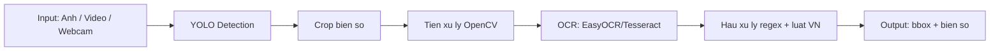

# Ke hoach do an nhan dien bien so xe VN (ban in bao cao)

> Mon: Thi giac may tinh  
> De tai: Nhan dien bien so xe Viet Nam (Detection + OCR)  
> Nhom: Group 3  
> Thoi gian: 7 buoi

---

## 1) Muc tieu tong the

- Xay dung pipeline hoan chinh: **YOLO Detector -> Crop -> Preprocess -> OCR -> Postprocess**.
- Dat muc tham chieu: **OCR >= 85%** tren **>= 200 anh test thuc te** (khong dung de train).
- Co demo chay duoc tren **anh / video / webcam** va bo tai lieu bao cao + slide.

---

## 2) Kien truc giai phap (tom tat)

**Stack de xuat**
- Python 3.10+
- Ultralytics YOLOv8
- OpenCV
- EasyOCR (uu tien), Tesseract (du phong)

---

## 3) Timeline 7 buoi (bang tom tat)

| Buoi | Trong tam | Dau ra chinh | Tieu chi hoan thanh |
|---|---|---|---|
| 1 | Khoi dong, chot bai toan, stack, pipeline | Ke hoach + mo ta bai toan + timeline | Co plan ro rang, moi thanh vien biet viec can lam |
| 2 | Du lieu + nhan + EDA + preprocess co ban | Dataset, splits, notebook EDA | >=300 anh, >=200 nhan, split hop le, EDA chay duoc |
| 3 | Train YOLO baseline | Model baseline + log train + infer mau | Co model baseline, infer duoc tren anh test |
| 4 | Thu nghiem cai tien model | Bang so sanh >=2 cau hinh | Chon duoc cau hinh tot nhat theo metric |
| 5 | Tich hop OCR + danh gia pipeline | Detector + OCR + postprocess | Bao cao OCR tren >=200 anh, co phan tich loi |
| 6 | Demo ung dung | Ban demo anh/video/webcam | Demo on dinh, hien thi bbox + text ro rang |
| 7 | Hoan thien bao cao & slide | Bao cao cuoi + slide + dien tap | San sang nop va bao ve |

---

## 4) Ke hoach chi tiet theo giai doan

### Giai doan A - Nen tang (Buoi 1-2)
- Hoan tat moi truong, cau truc repo, quy uoc du lieu.
- Chuan hoa dat ten file (`plate_0001.*`) va layout (`data/images/raw`, `data/labels/raw`, `data/splits`).
- Xac thuc du lieu bang EDA truoc khi train.

### Giai doan B - Mo hinh (Buoi 3-4)
- Train baseline -> danh gia -> cai tien.
- Luu y phep so sanh cong bang (cung dataset, cung split, cung metric).
- Chot 1 model detector cho buoi tich hop OCR.

### Giai doan C - Pipeline san pham (Buoi 5-7)
- Tich hop OCR + hau xu ly.
- Tinh metric thuc nghiem, tong hop uu/nhuoc diem.
- Hoan tat demo, bao cao, slide va ke hoach trinh bay.

---

## 5) Quan ly chat luong

### KPI toi thieu
- Detection: mAP tham chieu phu hop muc tieu do an.
- OCR: character accuracy >= 85% tren tap test doc lap.
- Demo: chay on dinh tren it nhat 1 video + 1 nguon webcam/anh.

### Kiem tra moi moc
- Truoc moi buoi: cap nhat checklist pending.
- Sau moi buoi: danh dau done + ghi ro van de ton dong.
- Neu co blocker: uu tien giai quyet blocker truoc khi mo rong tinh nang.

---

## 6) Rui ro chinh & cach giam rui ro

| Rui ro | Tac dong | Giam rui ro |
|---|---|---|
| Du lieu thieu da dang | OCR/Detection kem tren tinh huong la | Bo sung anh dem, xa/gan, xe may/o to |
| Nhan sai | Model hoc sai | Kiem tra bang EDA luoi anh + sua nhan truoc train |
| Qua nhieu huong ky thuat | Cham tien do | Chot 1 baseline som, toi uu dan |
| Demo giat/lag | Trinh bay khong tot | Giam FPS, resize frame, cache model |

---

## 7) Checklist ban giao cuoi do an

- [ ] Source code co huong dan chay ro rang.
- [ ] Model/dataset metadata duoc ghi chu day du.
- [ ] Demo chay duoc tren may nhom.
- [ ] Bao cao co ket qua, bang so sanh, phan tich loi.
- [ ] Slide ngan gon, ro metric, ro dong gop cua tung thanh vien.

---

## 8) Tai lieu lien ket trong repo

- Ke hoach tong: `.cursor/plans/do-an-nhan-dien-bien-so-vn_6b4a2954.plan.md`
- Buoi 1 (ban gon): `.cursor/plans/buoi1/plan_buoi1.md`
- Buoi 2 (ban gon): `.cursor/plans/buoi2/plan_buoi2.md`
- Mo ta bai toan: `docs/mo_ta_bai_toan.md`
- EDA notebook: `notebooks/eda_data.ipynb`

